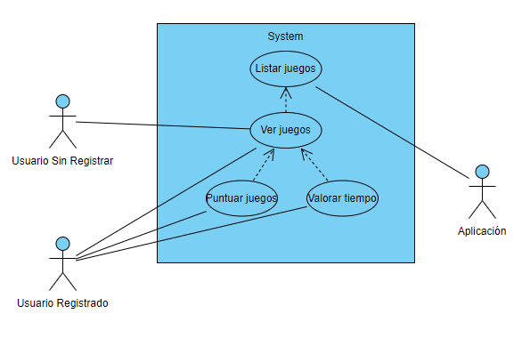
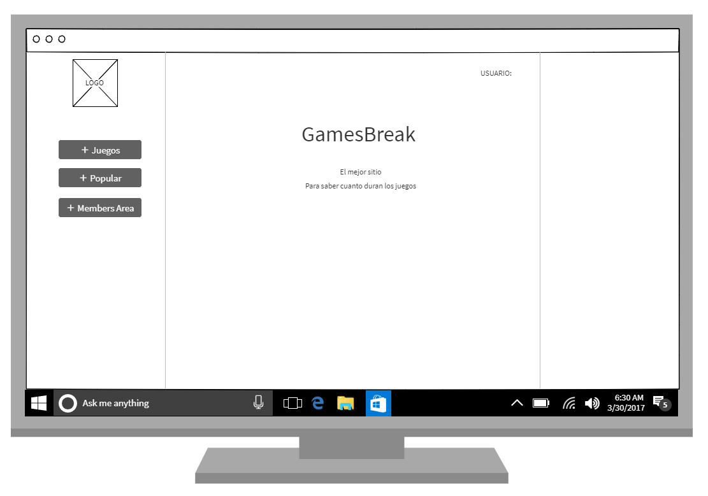
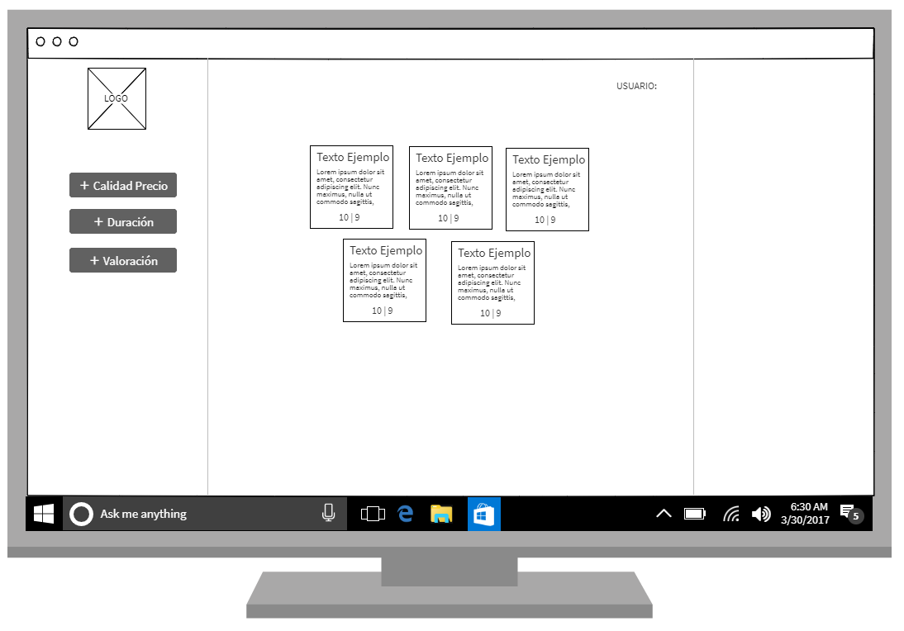
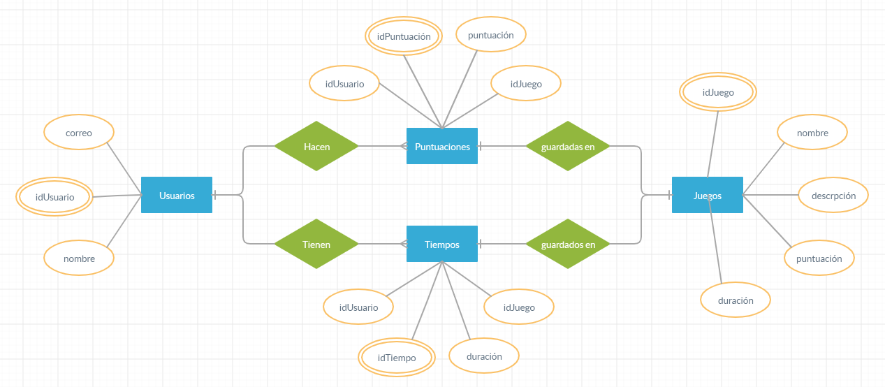
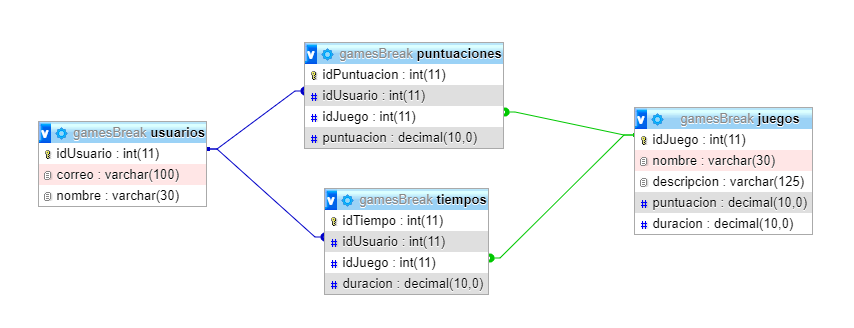

# Deseño

## Modelo conceptual do dominio da aplicación
Pode ser un diagrama de clases usando UML, ConML, ou outra linguaxe semellante.

## Casos de uso

## Deseño de interface de usuarios

- Página principal

- Listado de juegos

## Diagrama de Base de Datos.
Nesta fase tamén teremos que realizar:

- Modelo Entidade/relación

- Modelo relacional 

